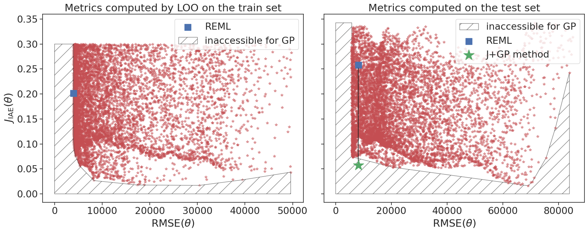

# Introduction

Implementation for the first Figure of the article "Gaussian process
interpolation with conformal prediction: methods and comparative analysis"

# Installation

First, create a virtual environment then install the requirements. Finally,  install
[GPMP](https://github.com/gpmp-dev/gpmp) package to build Gaussian process
models.

# Notebook 

The file notebook ```goldstein_price_cloud``` shows how to create the points
cloud in the article for the
[Godlstein-Price](https://www.sfu.ca/~ssurjano/goldpr.html) function.

You can create other cloud for functions using the test functions implemented in
the module ```gpmp.misc.testfunctions``` or using the functions in
```src.functions.py```.



# Documentation

The cloud is built using the class ```GPExperiment``` implemented in the file
```src.gpmodelmetrics.py```. When you instantiate the class, a design of
experiment is automatically created. Then you can use the two above methods:

- The ```evaluate_model_variation``` method is used to generate the cloud around the
parameter selected by restricted maximum likelihood.
- The ```j_plus_gp_point``` method is used to compute the IAE when the
prediction interval are computed using J+GP method.